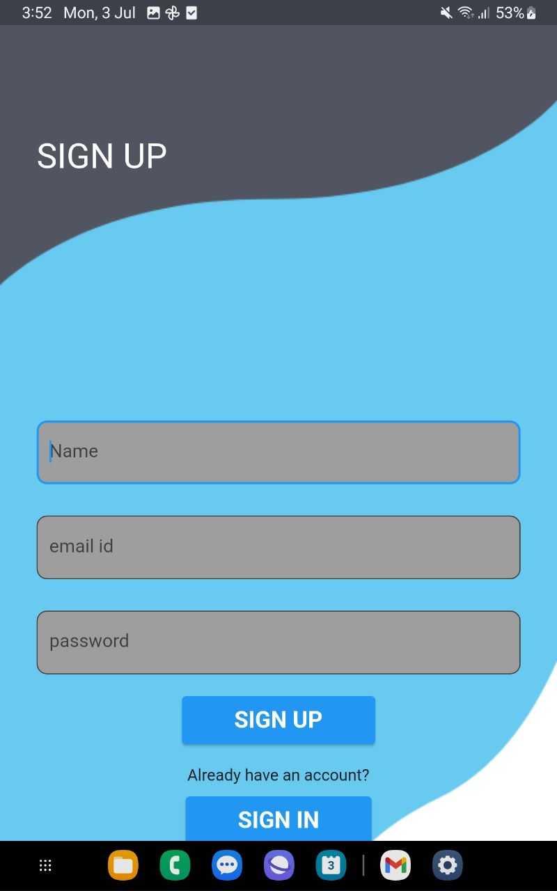

<h1>TripItOn</h1> 
TripItOn is a Flutter application that allows users to create and join hikes, share their travel experiences, and discover new places. Whether you're going on a solo trip or looking for adventure buddies, TripItOn has got you covered.  

<u>Features</u> 

<h4>Create Hike:</h4> Users can create a hike by specifying the start and end locations, along with the date and time. The selected locations can be picked directly from the map, making it convenient and accurate. 

<h4>Join Hike (Under Development):</h4> The join hike feature is currently in development. Stay tuned for future updates! 

<h4>Image Upload and Description:</h4> Users can upload images from their gallery or capture new ones using the camera. The images are stored in Firebase storage, and users can provide descriptions of the places or experiences associated with the images. 

<h4>Discover Places:</h4> The home screen features a horizontal list view builder that showcases various places and cultural activities. Users can scroll through the list and explore different destinations, gaining inspiration for their next adventure. 

<table>
  <tr>
    <td align="center">
      
       
      Signup
    </td>
    <td align="center">
      
       
      Create Hike
    </td>
    <td align="center">
      
       
      Create Hike
    </td>
  </tr>
  <tr>
    <td align="center">
      
       
      Create Hike
    </td>
    <td align="center">
      
       
      Create Hike
    </td>
    <td align="center">
      
       
      Create Hike
    </td>
  </tr>
</table>

<h2>Getting Started</h2>
To clone and run this project locally, follow these steps:

Clone the repository:

    git clone https://github.com/<your-username>/trips11.git

Navigate to the project directory:

    cd trips11

Install dependencies:

    flutter pub get

Run the app:

    flutter run

<h2>For more information on Flutter development, check out the official documentation for tutorials, samples, and a full API reference.
</h2>
<h2><u>Contributing</u></h2>
If you would like to contribute to TripItOn, follow these guidelines:

Fork the repository on GitHub.

Create a new branch with a descriptive name:

    git checkout -b descriptive_branch_name

Make your changes and commit them with clear commit messages.
git commit -m "Commit message"

Push your changes to your forked repository.

    git push origin descriptive_branch_name

Submit a pull request to the main repository.

Please ensure that your contributions adhere to the code quality and style guidelines of the project.

License
This project is licensed under the MIT License.

Feel free to explore, enhance, and customize TripItOn to suit your travel needs. Happy travels!
